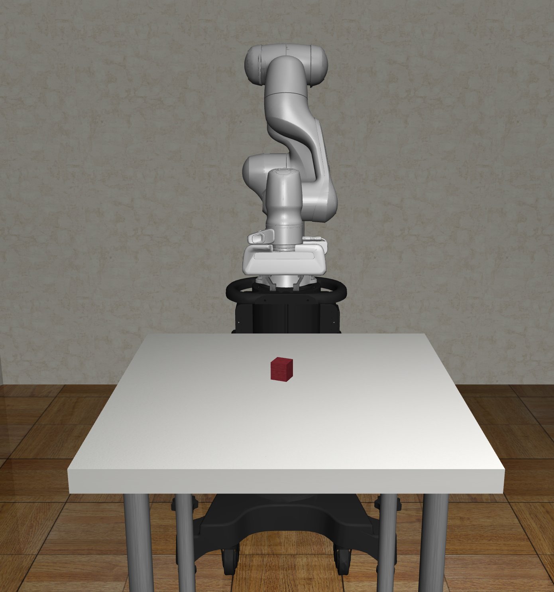

# CS221-Project

  
  
 

 <H1>Introduction</H1>

Welcome, in this project we train a robot arm to perform basic manipulation tasks in a simulated environment. In order to do so, we leverage the simulation framework <a href="https://github.com/ARISE-Initiative/robosuite">robosuite</a> which is powered by <a href="http://mujoco.org/">Mujoco</a>.  

The current version of this repository was used as a submission for Stanford's course CS221 Autumn 2020. In this version we implement the following algorithms to train a robotic arm to perform the task of lifting a block:

<ul>
  <li>REINFORCE</li>
  <li>Deep Deterministic Policy Gradient</li>
</ul>
In future versions, we will be building upon the current implementations with the goal of including additional algorithms as well as testing our own experiments.
<H1>Setting up training enviornment<H1>
  
<H1>Model Training<H1>
<H1>Further</H1>

Feel free to check out our <a href="https://peterdavidfagan.gitbook.io/peter-david-fagan/">docs</a> for further details.

