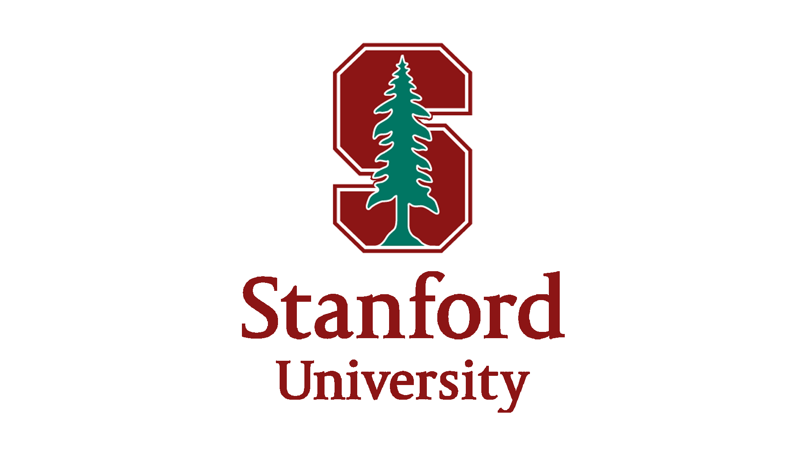

# CS221-Project

  
  
 

 <H1>Introduction</H1>

Welcome, in this project we train a robot arm to perform basic manipulation tasks in a simulated environment. In order to do so, we leverage the simulation framework <a href="https://github.com/ARISE-Initiative/robosuite">robosuite</a> which is powered by <a href="http://mujoco.org/">MuJoCo</a>.  

The current version of this repository was used as a submission for Stanford's course CS221 Autumn 2020. In this version we implement the following algorithms to train a robotic arm to perform the task of lifting a block:

<ul>
  <li>REINFORCE</li>
  <li>Deep Deterministic Policy Gradient</li>
</ul>

In future versions, we will be building upon the current implementations with the goal of including additional algorithms as well as testing our own experiments.

<H1>Prerequisites</H1>

A <a href="http://mujoco.org/">MuJoCo</a> license is needed to create this simulation enviornment. For more information on getting a license please visit the this <a href="https://www.roboti.us/license.html">link</a>.

<H1>Setting up training enviornment</H1>

To simplify the creation of the training enviorment we use Docker. You may find the Dockerfile used to build the container for the simulated environment in /Docker/Dockerfile. From here you will need to place your MuJoCo key in the same directory as the one you are building your docker container in. Given this is complete you may simply run the following command

<pre><code>$ docker build -t robosuite .
$ docker run -it -d --gpus all --name robosuite robosuite:latest
$ docker exec -t robosuite bash
</code></pre>
 

 This will provide you with access to the Docker container within which you will have all of the necessary dependencies installed to get started (given you placed the MuJoCo key in the same directory your container was built). 
 

<H1>Model Training</H1>
In order to track our model training we used <a href="https://www.wandb.com/">Weights and Biases</a>. Weights and biases enabled us to perform hyperparameter sweeps while storing all the necessary results. You can find our repo <a href="https://wandb.ai/peterdavidfagan/cs221-project">here</a>
  
<H1>Further</H1>

Feel free to check out our <a href="https://peterdavidfagan.gitbook.io/peter-david-fagan/robot-arm">docs</a> for further details.

